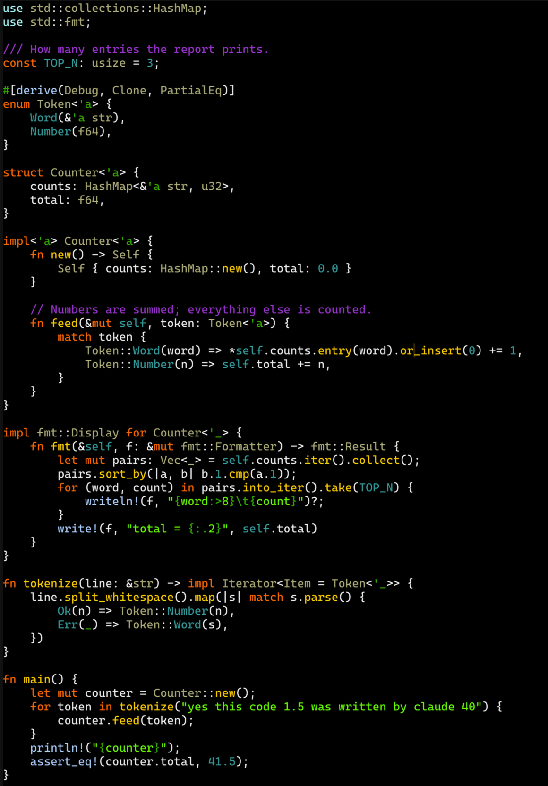
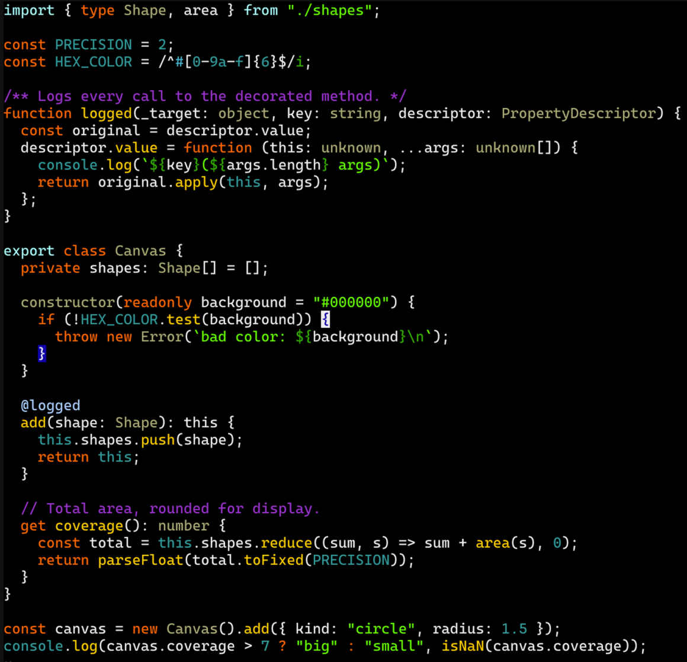

# neochalk

A Neovim colorscheme based on Tim Pope's
[vividchalk](https://github.com/tpope/vim-vividchalk), which was in turn based
on the Vibrant Ink theme for TextMate. Black background, saturated colors.

Written in Lua for treesitter and LSP semantic tokens. Requires Neovim 0.10+ (rough estimate;
compatibility not tested).





The source for both screenshots is in [`samples/`](samples/).

## Install

With [lazy.nvim](https://github.com/folke/lazy.nvim):

```lua
{ "gregates/neochalk.nvim", lazy = false, priority = 1000 }
```

```lua
vim.cmd.colorscheme("neochalk")
```

A matching [lualine](https://github.com/nvim-lualine/lualine.nvim) theme is
included and is picked up by lualine's default `auto` theme.

## Differences from vividchalk

The palette is vividchalk's. The main departures:

- Function calls are gold, like definitions.
- Macros and attributes/decorators share a pale blue (`#AACCFF`, `railsUserMethod` in vividchalk 1.x).
- No italics for comments (option can be added if anyone wants it, I just don't like it).
- Diff backgrounds are dark green/red/indigo rather than Vim's stock colors,
  and spelling and diagnostics use undercurls rather than background blocks.

## License

[MIT](LICENSE). The palette comes from vividchalk, which is distributed under
the Vim license.
